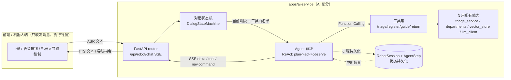
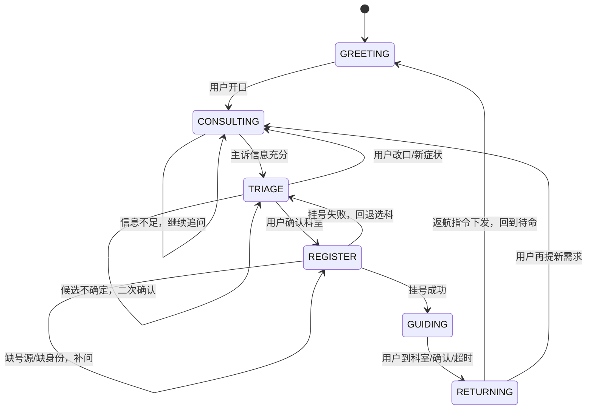

# 09 · 导诊机器人对话全流程：判断科室 -> 挂号 -> 引导 -> 返航

> 本文档设计导诊机器人「问诊 -> 判断科室 -> 挂号 -> 引导前往 -> 返航收尾」完整闭环的 AI 部分。
> 对应代码（待新增）：`apps/ai-service/app/services/agent/`、`apps/ai-service/app/services/robot/`、`apps/ai-service/app/api/routes/robot.py`
> 复用现有：`services/triage_service.py`、`services/departments.py`、`services/llm_client.py`、`services/vector_store.py`、`services/embedding.py`
> 范围说明：**仅 AI 部分**（对话状态机、Agent 循环、工具调用、状态持久化）。硬件执行（电机/导航/SLAM/麦克风/扬声器）不在本文档范围，AI 仅产出"导航/返航指令事件"下发给机器人端执行。

## 一、背景与问题

- 导诊机器人是一条**有状态的多步业务流**，不是单轮问答。现有四个服务（`chat/companion/science/triage`）均为「retrieve -> prompt -> stream -> persist」的单轮范式（`triage_service.py:66`、`chat_service.py:38`），一次 LLM 调用即结束，无法承载。
- 多轮状态有限：会话/消息已持久化（`Conversation`/`Message`，`models.py:32/43`），各服务 `_load_history` 取最近 N 条线性拼接（`chat_service.py:115`、`triage_service.py:261`），但**无状态机、无阶段、无中间步骤持久化**。
- 判断科室已有基础：`departments.py` 已实现 `match_departments`（`departments.py:90`）/ `resolve_primary`（`departments.py:106`），`triage_service.stream_answer` 末尾已回传 `department` + `matchedDepartments`（`triage_service.py:184`），可沉淀为工具，无需重写。
- 无 Agent / 无 Function Calling：`llm_client.chat_stream` 仅 `/v1/chat/completions` 文本流式（`llm_client.py:80`），未发送 `tools` 参数（`extra` 已预留透传位 `llm_client.py:99`，但无人使用）。无 Planning、无多步推理、无工具调用。
- 中断只标记不恢复：`CancelledError` 时持久化 `interrupted=True`（`chat_service.py:60`、`triage_service.py:142`），无法续写半截答案，无法续跑中断的 Agent 步骤。
- 挂号 / 引导 / 返航 / 状态机：均无。

## 二、整体架构

引入「对话状态机 + Agent 循环（ReAct）+ 工具调用（Function Calling）」三层架构：



三层职责：

| 层 | 职责 | 为什么需要 |
| --- | --- | --- |
| 状态机 | 管"当前在第几步、下一步该问什么"，决定系统提示词与可用工具集合 | 强流程业务（挂号不能跳过分诊）必须 FSM 主导，保证不可跳步 |
| Agent 循环 | 当前阶段内做 ReAct（想 -> 调工具 -> 观察 -> 再想），多步直到阶段完成 | 单轮 LLM 无法完成"查号源 -> 确认 -> 下单"这类多步动作 |
| 工具 | 把判断科室/挂号/引导/返航沉淀为可被 LLM 调用的函数 | 业务能力按 Skill 沉淀，AI 只产调用意图，不碰硬件 |

## 三、对话状态机（FSM）

整条流程是有限状态机，每个状态有自己的系统提示词、退出条件、可用工具白名单：



| 状态 | 系统提示词要点 | 可用工具（白名单） | 出口工具 -> 下一状态 |
| --- | --- | --- | --- |
| `GREETING` | 主动问候、询问是否需要导诊 | -- | 用户开口 -> `CONSULTING` |
| `CONSULTING` | 1-3 个开放式问题收集主诉/持续时长/严重程度/既往史 | `finish_consulting` | `finish_consulting` -> `TRIAGE` |
| `TRIAGE` | 依据问诊结果调工具，多候选时向用户确认 | `determine_department`, `confirm_department` | `confirm_department` -> `REGISTER` |
| `REGISTER` | 查号源 -> 确认 -> 下单，失败则告知并回退 | `check_registration_tool`, `create_registration` | `create_registration` 成功 -> `GUIDING` |
| `GUIDING` | 调工具生成路径，输出简短口播 | `guide_to_department`, `finish_guiding` | `finish_guiding` -> `RETURNING` |
| `RETURNING` | 下发返航指令，确认后回到待命 | `return_to_home`, `finish_session` | `finish_session` -> `GREETING` |

设计要点：

- **仅"出口工具"可触发状态转移**：`finish_consulting`/`confirm_department`/`create_registration`/`finish_guiding`/`finish_session`，显式、可审计。
- **回退路径**：`TRIAGE->CONSULTING`（用户改口/新症状）、`REGISTER->TRIAGE`（挂号失败），覆盖异常分支。
- **状态机 vs 纯 Agent**：强流程业务必须 FSM 主导；Agent 循环只在阶段内做推理。纯 ReAct 易"自由发挥"跳步，业务不可控。

## 四、Agent 运行内核（ReAct + Function Calling）

### 4.1 扩展 `llm_client.py` 支持 tools

现状 `chat_stream` 已预留 `extra` 透传位（`llm_client.py:99`），但未发 `tools`，`_parse_delta`（`llm_client.py:112`）只解析 `delta.content`。需两处增量增强，保持向后兼容（不传 `tools` 时行为与现有四服务一致）：

- `chat_stream` 增加 `tools: list[dict] | None`、`tool_choice` 透传。
- `_parse_delta` -> `_parse_delta_event`：同时解析 `delta.content` 与 `delta.tool_calls[].function.{name,arguments}` 流式累积，yield `{type: text|tool_call, ...}`。

```python
# llm_client.py 增强（骨架）
async def chat_stream(
    self,
    messages: list[dict],
    *,
    tools: list[dict] | None = None,        # 新增：OpenAI function schema
    tool_choice: str | dict | None = None,   # 新增
    temperature: float | None = None,
    max_tokens: int | None = None,
) -> AsyncIterator[dict]:                    # 改为 yield dict 事件
    payload = {"model": self.llm_model, "messages": messages, "stream": True}
    if tools:
        payload["tools"] = tools
        if tool_choice:
            payload["tool_choice"] = tool_choice
    # ... stream ...
    async for line in resp.aiter_lines():
        evt = _parse_delta_event(line)       # 同时解析 content 和 tool_calls
        if evt:
            yield evt

def _parse_delta_event(line: str) -> dict | None:
    # delta.content          -> {"type": "text", "text": ...}
    # delta.tool_calls[].id / function.name / arguments（流式累积）-> {"type": "tool_call", ...}
    ...
```

### 4.2 Agent 主循环（`app/services/agent/agent.py`）

ReAct 循环：observe（读状态+历史）-> plan/act（喂工具白名单给 LLM）-> observe（工具结果回填 messages，`role: tool`）。单步重试 / 超时 / 熔断，单步失败不崩整条链（对齐 `todo/01`）。

```python
async def run_turn(self, user_text, conv_id, principal) -> AsyncIterator[dict]:
    state = await self._load_state(conv_id)            # DialogState + working_memory
    cfg = STATE_CONFIG[state.current]
    messages = self._build_messages(state, user_text)  # system + history + user

    for step in range(self._max_steps):                 # 防失控
        tool_call = None
        async for evt in self._client.chat_stream(
            messages, tools=self._schemas(cfg["tools"])
        ):
            if evt["type"] == "text":
                yield {"delta": evt["text"]}
                self._buf.append(evt["text"])
            elif evt["type"] == "tool_call":
                tool_call = evt["tool_call"]

        if not tool_call:                               # 无工具调用=自然语言回复，本轮结束
            break

        # 工具白名单二次校验：LLM 想跨阶段调用直接拒绝（医疗场景安全底线）
        observation = await self._dispatch(tool_call, allowed=cfg["tools"], state=state)
        messages.append({"role": "assistant", "tool_calls": [tool_call]})
        messages.append({"role": "tool", "tool_call_id": tool_call["id"], "content": observation})

        # 出口工具触发状态转移
        if self._is_exit_tool(tool_call["name"]):
            state.transition(cfg["exit_to"])

        await self._persist_step(conv_id, step, tool_call, observation, status="done")

    await self._persist_state(conv_id, state)
```

## 五、工具集（ToolBase 契约，对齐 `todo/04`）

全部落到 `app/services/agent/tools/`。AI 只产出**调用意图+参数**，硬件动作收敛为 SSE 指令事件，机器人端订阅执行并回传结果作为下一轮 observation。

| 工具 | 阶段 | 入参 | 出参（observation） | 作用 |
| --- | --- | --- | --- | --- |
| `finish_consulting` | CONSULTING | `summary` | `ok` | 出口，转 TRIAGE |
| `determine_department` | TRIAGE | `symptoms` | `[{department, confidence, reason}]` | 复用 `departments.match_departments`（`departments.py:90`）+ `vector_store` 检索 |
| `confirm_department` | TRIAGE | `department_id` | `{department, location}` | 出口，转 REGISTER |
| `check_registration_tool` | REGISTER | `department_id`, `date?` | `[{doctor, time, remaining}]` | 查号源（HIS 占位/mock） |
| `create_registration` | REGISTER | `department_id`, `slot_id`, `patient_id` | `{reg_id, queue_no}` / `{error}` | 出口，成功转 GUIDING |
| `guide_to_department` | GUIDING | `department_id` | `{path_text, waypoints}` + 下发 `nav.command` 事件 | 产出导航口播 |
| `finish_guiding` | GUIDING | `reg_id` | `ok` | 出口，转 RETURNING |
| `return_to_home` | RETURNING | `reg_id` | `{eta}` + 下发 `nav.command` 事件 | 产出返航指令 |
| `finish_session` | RETURNING | -- | `ok` | 出口，转 GREETING |

JSON Schema 示例（`determine_department`，由 `ToolBase` 自动生成）：

```json
{
  "type": "function",
  "function": {
    "name": "determine_department",
    "description": "根据患者主诉判断候选就诊科室，返回带置信度的列表，不要自行下诊断",
    "parameters": {
      "type": "object",
      "properties": {
        "symptoms": {"type": "string", "description": "患者主诉摘要"}
      },
      "required": ["symptoms"]
    }
  }
}
```

工具实现骨架（复用现有能力，不碰硬件）：

```python
# tools/triage_tool.py
class DetermineDepartmentTool(ToolBase):
    name = "determine_department"

    async def invoke(self, symptoms: str) -> str:
        # 复用现有 triage_service 的 RAG 检索 + resolve_primary 逻辑
        emb = await embedding_service.embed_one(symptoms)
        retrieved = vector_store.query(emb, scopes=["public"], n_results=4)
        primary = resolve_primary("\n".join(r["document"] for r in retrieved))
        candidates = match_departments(symptoms)
        return json.dumps([
            {"department": d.name,
             "confidence": "high" if d == primary else "low",
             "reason": "匹配主诉关键词"}
            for d in candidates[:3]
        ], ensure_ascii=False)


# tools/guide_tool.py —— AI 只产指令事件，不调电机
class GuideToDepartmentTool(ToolBase):
    name = "guide_to_department"

    def __init__(self, emitter):   # emitter = SSE 事件下发回调
        self._emit = emitter

    async def invoke(self, department_id: str) -> str:
        dept = _lookup(department_id)
        self._emit({"type": "nav.command", "target": dept.location, "mode": "guide"})
        return json.dumps(
            {"path_text": f"请前往{dept.name}，位于{dept.location}", "waypoints": []},
            ensure_ascii=False,
        )
```

工具白名单二次校验（医疗场景安全底线）：

```python
async def _dispatch(self, tool_call, *, allowed: list[str], state) -> str:
    if tool_call["name"] not in allowed:
        # LLM 想跨阶段调用工具，直接拒绝并告知
        return json.dumps({"error": "tool_not_allowed_in_state",
                           "current_state": state.current})
    tool = self._registry[tool_call["name"]]
    return await tool.invoke(**tool_call["args"])
```

## 六、状态持久化与中断恢复

现状只存 `Conversation`/`Message`（线性历史，`models.py:32/43`），无阶段状态、无中间步骤。按 `todo/01` 扩展两张表：

```python
# db/models.py 扩展
class RobotSession(Base):
    __tablename__ = "robot_sessions"
    id: Mapped[str] = mapped_column(String, primary_key=True)        # = conversation_id
    owner_id: Mapped[str] = mapped_column(String(64), index=True)
    current_state: Mapped[str] = mapped_column(String(32), default="greeting")
    working_memory: Mapped[dict] = mapped_column(JSON, default=dict)
    # working_memory 存：主诉摘要、已选科室、挂号单号，供后续阶段引用
    updated_at: Mapped[datetime] = mapped_column(DateTime, onupdate=_utcnow)

class AgentStep(Base):
    __tablename__ = "agent_steps"
    id: Mapped[str] = mapped_column(String, primary_key=True)
    session_id: Mapped[str] = mapped_column(ForeignKey("robot_sessions.id"), index=True)
    step_no: Mapped[int]
    state: Mapped[str]                  # 触发时的 DialogState
    thought: Mapped[str | None]         # LLM 推理
    action: Mapped[str | None]          # 工具名+参数
    observation: Mapped[str | None]     # 工具返回
    status: Mapped[str]                # done / failed / interrupted
    created_at: Mapped[datetime] = mapped_column(DateTime, default=_utcnow)
```

- **跨阶段记忆**：`working_memory` 存主诉摘要、确认科室、挂号单号，供 CONSULTING 产出喂给 TRIAGE，REGISTER 产出喂给 GUIDING。
- **中断恢复**：SSE 断流时（现有 `CancelledError` 只标记不恢复，见 `chat_service.py:60`）`AgentStep` 记 `interrupted`，重连从最后 `done` 步续跑；`RobotSession.current_state` 读回状态机位置。
- **迁移**：`main.py:_run_lightweight_migrations`（`main.py:17`）沿用现有 `ALTER TABLE` 分支模式补建新表。

## 七、配置项（`app/core/config.py`，对齐现有风格）

```ini
# --- Robot dialog flow (state machine + agent + tools) ---
# 每轮 Agent 循环最大步数，防失控
ROBOT_MAX_STEPS: int = 6
# 单步 LLM/工具调用超时（秒）
ROBOT_STEP_TIMEOUT: float = 30.0
# 历史条数上限（沿用 CHAT_MAX_HISTORY 思路）
ROBOT_MAX_HISTORY: int = 8
# 工具调用是否通过 SSE 透传给前端
ROBOT_EMIT_TOOL_EVENTS: bool = True
# 挂号工具 HIS 接入地址（占位，未配置时走 mock 号源）
ROBOT_HIS_BASE_URL: str = ""
```

## 八、对外接口与 SSE 事件协议

新增 `app/api/routes/robot.py`，复用现有 SSE 协议（`triage.py:24` `_SSE_HEADERS`、`triage.py:56` `data: {json}\n\n`），在现有事件集合上扩展：

### 8.1 接口

- `POST /api/robot/chat`（SSE）：发送消息，返回流式事件。
- `GET /api/robot/state/{conversation_id}`：查当前阶段与 working memory。

### 8.2 事件序列（在现有 `conversationId/delta/done` 基础上新增三类）

```
data: {"conversationId":"..."}                          # 首帧
data: {"event":"state","current":"triage"}              # 新增：状态转移通知
data: {"event":"tool","name":"determine_department",    # 新增：工具调用透明给前端
       "args":{"symptoms":"..."},"result":[...]}
data: {"event":"nav.command","target":"3F-内科-301",     # 新增：导航/返航指令，机器人端订阅执行
       "mode":"guide"}
data: {"delta":"请前往内科..."}                          # 逐字口播
data: {"done":true}
data: [DONE]
```

事件说明：

| 事件 | 消费者 | 作用 |
| --- | --- | --- |
| `state` | 前端 | 渲染当前阶段（问诊/分诊/挂号/引导/返航） |
| `tool` | 前端 | 可选展示工具调用过程（可配 `ROBOT_EMIT_TOOL_EVENTS` 关闭） |
| `nav.command` | 机器人端 | 执行导航/返航，回传到达/失败作为下一轮输入 |
| `delta` | 前端 | TTS 文本播报 |
| `error` | 前端 | 复用现有错误语义（`triage_service.py:95`） |

### 8.3 门面服务

`app/services/robot/robot_service.py` 组装 state machine + agent + tools，单例懒加载（参考 `vector_store.py` `get_vector_store` 模式）。`main.py` 注册 `robot.router`（对齐 `main.py:68-75` 现有注册风格）。

## 九、与现有代码的集成路径

```
app/services/
├── agent/                      # todo/01 + 04 落地
│   ├── agent.py                # ReAct 主循环
│   ├── state.py                # DialogState / STATE_CONFIG
│   ├── workflow.py             # 状态机驱动（todo/05）
│   └── tools/
│       ├── base.py             # ToolBase 契约
│       ├── triage_tool.py      # 复用 departments.py + vector_store
│       ├── register_tool.py    # 挂号（对接 HIS 占位）
│       ├── guide_tool.py       # 引导，产出 nav.command 事件
│       └── return_tool.py      # 返航
└── robot/
    └── robot_service.py        # 对外门面，组装 state machine + agent + tools
app/api/routes/
└── robot.py                    # POST /api/robot/chat (SSE) + GET /state
```

- `llm_client.py` 改动最小化：增量加 `tools` 支持 + tool_call 解析，`extra` 已预留，向后兼容现有四个 service。
- `triage_service.py` 的 RAG + `resolve_primary`（`triage_service.py:184`）直接包成 `determine_department` 工具，不重写。
- SSE 事件约定沿用现有四服务格式（`triage.py:56`）。

## 十、落地顺序（分阶段、低风险）

1. **Phase 1 - Agent 内核**（对齐 `todo/01`）：`llm_client` 增 tools 支持 + tool_call 解析；建 `agent.py` ReAct 循环 + `AgentStep` 持久化。先用 mock 工具跑通"LLM 调工具 -> 拿结果 -> 再回答"。
2. **Phase 2 - 状态机**（对齐 `todo/05`）：`DialogState` + `STATE_CONFIG` + `RobotSession`；把现有 `triage_service` 判断科室包成 `determine_department`，跑通 CONSULTING -> TRIAGE。
3. **Phase 3 - 工具落地**（对齐 `todo/04`）：`register_tool`（mock 号源，HIS 契约预留）、`guide_tool`/`return_tool`（只产 `nav.command`）。跑通完整 5 段闭环。
4. **Phase 4 - 中断恢复 + 可观测**（对齐 `todo/05、06`）：断点续跑、trace 贯穿每步、工具成功率监控。
5. **Phase 5 - 前端/机器人端**：接 `/api/robot/chat`，渲染事件，语音播报，订阅 `nav.command` 执行。

## 十一、关键设计决策

- **状态机 vs 纯 Agent**：强流程业务（挂号不能跳过分诊）必须 FSM 主导；Agent 循环只在阶段内做推理。纯 ReAct 易"自由发挥"跳步，业务不可控。
- **工具白名单**：每阶段只暴露该阶段工具给 LLM，服务端二次校验（`_dispatch`），防 LLM 幻觉跨阶段调用 -- 医疗场景安全底线。
- **硬件解耦**：AI 产 `nav.command` 事件而非直接调电机；机器人端订阅执行并回传结果作为 observation，契合"只负责 AI 部分"。
- **复用而非重写**：`triage_service` 的 RAG + `resolve_primary` 直接包成工具；`llm_client` 只增量加 tools 支持；SSE 事件约定沿用现有四服务格式。
- **出口工具显式化**：状态转移只能由 `finish_*`/`confirm_*`/`create_*` 触发，显式、可审计，便于故障排查与回放。

## 十二、面试可能的问题

以下问题覆盖本次设计的核心决策，可作面试自测或讲解提纲。

### 12.1 为什么导诊机器人不能直接用现有的 triage_service 单轮模式？

- 现有 `triage_service.stream_answer`（`triage_service.py:66`）是单轮 RAG：一次 LLM 调用即结束。
- 导诊是 5 段强流程（问诊 -> 分诊 -> 挂号 -> 引导 -> 返航），需要多步推理、工具调用、跨阶段记忆，单轮范式无法承载。
- 需要状态机保证流程不可跳步（挂号不能跳过分诊）。

### 12.2 状态机和 Agent 循环为什么要分层？不能纯 ReAct 吗？

- 强流程业务必须 FSM 主导：挂号有明确前置（确认科室才能挂号），纯 ReAct 易自由发挥跳步，业务不可控。
- Agent 循环只在"阶段内"做多步推理（如挂号阶段内：查号源 -> 确认 -> 下单），与状态机正交、可叠加。
- 状态机决定可用工具集合与系统提示词，Agent 决定单步怎么推理与调用。

### 12.3 工具白名单二次校验的意义？

- 每阶段只把该阶段的工具 schema 喂给 LLM，但 LLM 仍可能幻觉。
- 服务端 `_dispatch` 二次校验：LLM 想跨阶段调用工具直接拒绝，返回 `tool_not_allowed_in_state`。
- 这是医疗场景的安全底线 -- 防止"还没确认科室就触发挂号"这类违规流程。

### 12.4 AI 只负责逻辑，硬件导航怎么解耦？

- AI 产 `nav.command` SSE 事件（target + mode），不直接调电机。
- 机器人端订阅 `nav.command` 执行导航/返航，回传到达/失败作为下一轮 LLM 的 observation。
- AI 决策层与硬件执行层解耦，AI 部分可独立开发测试。

### 12.5 中断恢复怎么实现？

- 现有 `CancelledError` 只标记 `interrupted=True`（`chat_service.py:60`），无法续写。
- 新增 `AgentStep` 持久化每步 thought/action/observation/status。
- 断流时记 `interrupted`，重连从最后 `done` 步续跑；`RobotSession.current_state` 读回状态机位置，不丢上下文。

### 12.6 判断科室工具怎么复用现有代码？

- `determine_department` 工具直接复用 `departments.match_departments`（`departments.py:90`）和 `resolve_primary`（`departments.py:106`）。
- RAG 检索复用 `embedding_service.embed_one` + `vector_store.query`（`triage_service.py:86-89` 的同款逻辑）。
- 把"判断科室"从 triage_service 的硬编码能力，沉淀为可被 Agent 调用的工具。

### 12.7 挂号工具的 HIS 对接怎么处理？

- 先用 mock 号源跑通闭环，HIS 契约预留（`ROBOT_HIS_BASE_URL` 为空时走 mock）。
- `check_registration_tool` / `create_registration` 封装 HIS 调用，带超时/重试（复用 `llm_client.py` 的 httpx 模式）。
- 挂号失败时回退到 TRIAGE 重新选科，覆盖异常分支。

### 12.8 working_memory 跨阶段记忆的作用？

- CONSULTING 产出的主诉摘要喂给 TRIAGE 的 `determine_department`。
- TRIAGE 确认的科室喂给 REGISTER 的 `check_registration_tool`。
- REGISTER 的挂号单号喂给 GUIDING 的 `finish_guiding`。
- 没有跨阶段记忆，每阶段都得重新问，体验差且易出错。

### 12.9 SSE 事件协议为什么新增三类事件？

- `state`：让前端渲染当前阶段，提供流程进度感。
- `tool`：工具调用过程透明给前端，便于调试与可观测（可配置关闭）。
- `nav.command`：导航/返航指令，机器人端订阅执行，是 AI 与硬件的解耦点。
- 沿用现有 `conversationId/delta/done/error` 格式，向后兼容。

### 12.10 整体落地为什么分 5 个 Phase？

- Phase 1（Agent 内核）先跑通"调工具"机制，风险隔离。
- Phase 2（状态机）先跑通前两段，复用现有 triage 能力。
- Phase 3（工具落地）跑通完整闭环，mock 优先。
- Phase 4（中断恢复+可观测）补工程稳定性。
- Phase 5（前端/机器人端）最后接入。
- 每阶段可独立验证、低风险递进。
